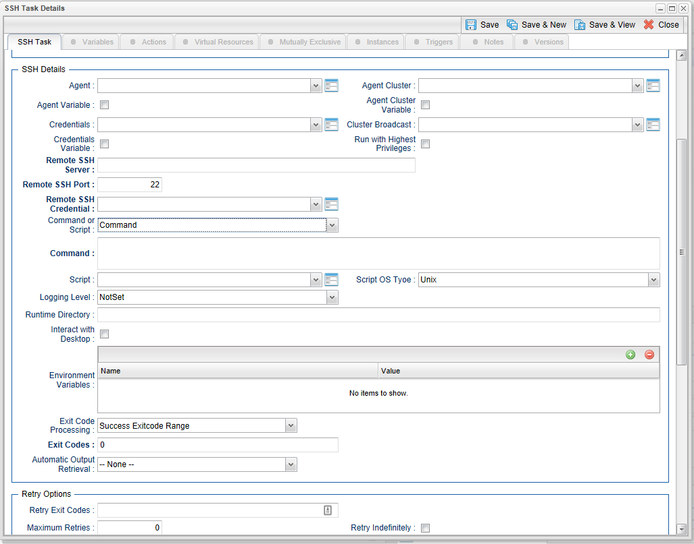

# ut-ssh-server-linux-windows
Universal Task to run a command or Universal Controller "data" script on a remote ssh server. Enables the execution of commands and scripts from the Universal Controller script library on a remote Unix/Linux, or Windows SSH server (Note: this Universal Task has only been tested on Windows).

# Abstract: 
Universal Task to run a command or Universal Controller "data" script on a remote ssh server. Enables the execution of commands and scripts from the Universal Controller script library on a remote Unix/Linux, or Windows SSH Server.
 
 
# 1	Disclaimer
No support and no warranty are provided by Stonebranch Inc for this document and the related Universal Task. The use of this document and
the related Universal Task is on your own risk.

Before using this task in a production system, please perform extensive testing.

Stonebranch Inc assumes no liability for damage caused by the performance of the Universal Tasks.

# 2	Introduction
Universal Task to run a command or Universal Controller "data" script on a remote SSH Server.

Enables the execution of commands and scripts from the Universal Controller script library on a remote Unix/Linux or Windows SSH server.
  - The Universal Task will end with the exit code from the remote command/script.
  - Both stdout and stderr from the remote task are returned to the Universal Task's stdout. Stderr is used for messages from the
Universal Task itself.

  - Requires Python 3.6 or higher with the ssh2-python module installed.
  - Tested with the Universal Agent bundled Python distribution.
  - You can set different log-levels for the Universal task, providing you more or less information to suit your needs.
  - The Universal Task supports both Linux/Unix and Windows.

Users should note that the SSH task is unable to provide the following functionality that is available for tasks that execute on a
Universal Agent:
  - No Agent visibility, status, or alerting is available.
  - The remote command or script cannot be cancelled from the controller UI, cancelling the SSH task will only cancel the Universal Task

Python script that is initiating the SSH session.
  - No fault tolerant functionality.
  - No clustering, load balancing, or broadcast functionality.

# 3	Software Requirements
Requires Python 3.6 or higher with the ssh2-python module installed.

